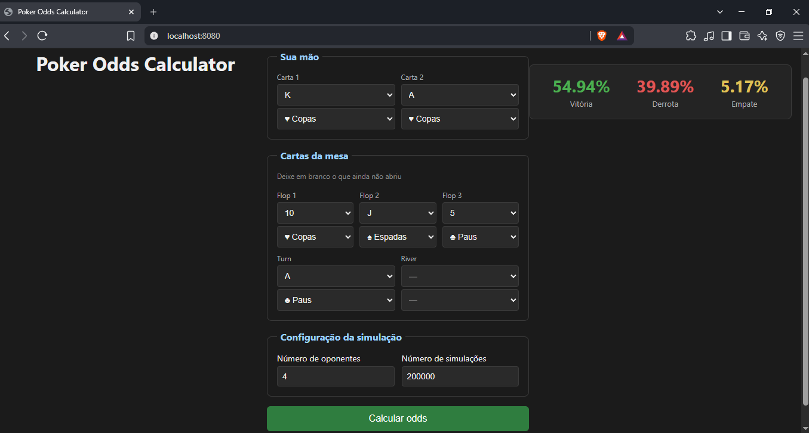

# Poker Odds Calculator

Calculadora de probabilidades para Texas Hold'em. Informe sua mão e as cartas da mesa, e a aplicação estima sua chance real de vitória através de simulação de Monte Carlo.

Funciona em todas as fases da mão — pré-flop, flop, turn e river — permitindo acompanhar como suas chances mudam conforme as cartas abrem.



---

## Funcionalidades

- Cálculo de equity contra 1 a 9 oponentes
- Suporte às quatro fases da mão (pré-flop, flop, turn, river)
- Avaliação completa de mãos de poker, incluindo desempate por kicker e a sequência A-2-3-4-5 com o Ás valendo 1
- Simulação paralelizada, adaptando-se automaticamente ao número de núcleos disponíveis
- API REST com validação de entrada e respostas de erro padronizadas
- Interface web sem dependências externas de front-end

## Stack

| Camada | Tecnologia |
|---|---|
| Back-end | Java 17+, Spring Boot 4 |
| Build | Maven |
| Testes | JUnit 5 |
| Front-end | HTML, CSS e JavaScript puro (sem framework) |

O front-end é servido pelo próprio Spring Boot a partir de `src/main/resources/static`, o que mantém API e interface na mesma origem e dispensa configuração de CORS.

## Como rodar

Pré-requisito: JDK 17 ou superior.

```bash
./mvnw spring-boot:run
```

No Windows, use `mvnw.cmd`. Se o Maven reclamar de `JAVA_HOME`, aponte a variável para a sua instalação do JDK antes de rodar.

Depois disso, acesse:

```
http://localhost:8080
```

Para rodar os testes:

```bash
./mvnw test
```

## API

### `POST /api/odds`

**Requisição**

```json
{
  "heroCards": [
    { "rank": "ACE", "suit": "HEARTS" },
    { "rank": "ACE", "suit": "SPADES" }
  ],
  "communityCards": [
    { "rank": "KING", "suit": "HEARTS" },
    { "rank": "TWO", "suit": "CLUBS" },
    { "rank": "SEVEN", "suit": "DIAMONDS" }
  ],
  "opponents": 1,
  "simulations": 10000
}
```

| Campo | Regra |
|---|---|
| `heroCards` | Exatamente 2 cartas |
| `communityCards` | 0 (pré-flop), 3 (flop), 4 (turn) ou 5 (river). Pode ser omitido |
| `opponents` | Entre 1 e 9 |
| `simulations` | Entre 1.000 e 200.000 |

Valores de `rank`: `TWO` a `TEN`, `JACK`, `QUEEN`, `KING`, `ACE`.
Valores de `suit`: `HEARTS`, `DIAMONDS`, `CLUBS`, `SPADES`.

**Resposta — 200 OK**

```json
{
  "wins": 8897,
  "losses": 1092,
  "ties": 11,
  "simulations": 10000,
  "winPercentage": 88.97,
  "lossPercentage": 10.92,
  "tiePercentage": 0.11
}
```

**Resposta — 400 Bad Request**

```json
{
  "status": 400,
  "message": "Dados inválidos na requisição",
  "details": ["O herói deve ter exatamente 2 cartas"],
  "timestamp": "2026-08-04T14:45:58.503"
}
```

Erros de validação e de domínio (cartas repetidas, quantidade inválida de cartas na mesa) são tratados de forma centralizada por um `@RestControllerAdvice`, garantindo o mesmo formato de resposta em toda a API.

## Performance

O caso mais pesado suportado — 200.000 simulações contra 9 oponentes — levava **91,6 segundos** na versão sequencial, tempo inviável para uma aplicação web.

A simulação foi paralelizada dividindo o total em blocos independentes, um por processador disponível. Cada bloco mantém seus próprios contadores e devolve um resultado parcial; a soma acontece uma única vez, depois que todos terminam. Não há estado mutável compartilhado entre threads, o que dispensa locks e elimina a possibilidade de condições de corrida.

| Versão | Tempo |
|---|---|
| Sequencial | 91.611 ms |
| Paralela | 17.388 ms |
| **Ganho** | **5,3×** |

Medido em um AMD Ryzen 5 5600X (6 núcleos físicos, 12 threads).

O ganho fica abaixo das 12 threads disponíveis por dois motivos: SMT não equivale a núcleos físicos (acrescenta cerca de 20-30% de throughput, não o dobro), e a alocação de objetos por simulação transfere parte do gargalo da CPU para o subsistema de memória e o coletor de lixo.

## Testes

A lógica de avaliação de mãos é coberta por testes unitários, incluindo os casos mais propensos a erro:

- Identificação de royal flush
- Sequência A-2-3-4-5, em que o Ás vale 1 e não 14
- Hierarquia entre categorias (full house vence flush)
- Desempate entre mãos de mesma categoria pelo kicker
- Seleção da melhor combinação de 5 cartas entre 7
- Rejeição de mãos com menos de 5 cartas

Os testes foram escritos antes da paralelização, o que permitiu refatorar a simulação com a garantia de que a lógica de avaliação permanecia intacta.

## Estrutura

```
src/main/java/com/GabrielFonseca/pokeroddscalculator/
├── controller/    # Endpoint REST
├── dto/           # Contratos de entrada e saída da API
├── exception/     # Tratamento centralizado de erros
├── model/         # Card, Rank, Suit, Deck, Hand, HandRank, OddsResult
├── service/       # HandEvaluator — classificação e comparação de mãos
└── simulation/    # MonteCarloSimulation — particionamento e execução paralela

src/main/resources/static/    # Interface web
src/test/java/                # Testes unitários
```

### Como a avaliação de mãos funciona

Uma mão de Texas Hold'em no showdown tem 7 cartas (2 na mão + 5 na mesa), mas apenas 5 valem. O `CombinationGenerator` gera as C(7,5) = 21 combinações possíveis, o `HandEvaluator` classifica cada uma, e a melhor é selecionada.

Cada avaliação devolve a categoria da mão (par, trinca, flush...) junto com os valores de desempate ordenados, permitindo comparar duas mãos da mesma categoria corretamente.

## Próximos passos

- **Enumeração exata** nas situações em que o espaço de possibilidades é pequeno o bastante. Pós-river contra um oponente tem apenas C(45,2) = 990 combinações possíveis — é viável calcular a resposta exata, e mais rápido do que estimá-la por amostragem
- **Otimização do avaliador de mãos**, hoje o principal consumidor de CPU
- **Pot odds e valor esperado**, transformando a calculadora de uma ferramenta de estimativa em uma ferramenta de decisão
- **Deploy** em ambiente público

---

Desenvolvido por [Gabriel Fonseca](https://github.com/GabrielFonseca02).
